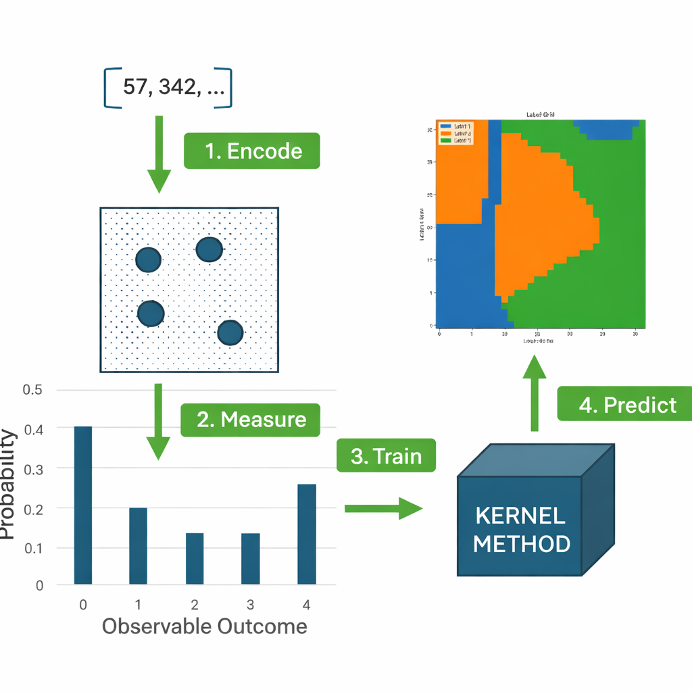

# qkernel
`qkernel` is a package for running quantum kernel models.

The quantum kernel is based on a analogue computing framework as introduced by Henry et al. (for details see [here](https://arxiv.org/pdf/2107.03247) and [here](https://journals.aps.org/pra/abstract/10.1103/PhysRevA.107.042615)). 

## Installation

This project uses [uv](https://docs.astral.sh/uv/) for dependency management.

1. Install uv (if you don't have it already):
   \`\`\`bash
   curl -LsSf https://astral.sh/uv/install.sh | sh
   \`\`\`

2. Clone the repository and install dependencies:
   \`\`\`bash
   git clone git@github.com:ICHEC/qkernel.git
   cd qkernel
   uv sync
   \`\`\`

   > Note: `qkernel4eo` is installed directly from its private GitHub repo over SSH, so make sure your SSH key is set up with GitHub before running `uv sync`.

3. Run commands within the environment using `uv run`, e.g.:
   \`\`\`bash
   uv run pytest
   \`\`\`

## Repository Contents

The source code is contained in `qkernel`. Some of the more important files in there are: 

- `hamiltonian.py`: Class for hamiltonian construction out of graphs. 
- `kernel.py`: Class for generating kernels out of probability distributions.
- `model.py`: Class for implementing kernel models. 
- `pipeline.py`: Class for implementing a pipeline with all necessary steps. 
Tutorial on how to use the pipeline can be found in [here](docs/tutorials/pipeline.ipynb).
- `simulator.py`: Class for simulating neutral atom devices. 
- `utils.py`: Class with different utility functions.

### Analogue Quantum Kernel

The quantum kernel computed here is designed for analogue quantum computers, a common choice of modality for implementing this is neutral atom quantum computers. The main idea here (as developed by Henry et al.) is to encode the feature vector data into the positions and topology of the qubits. A constant pulse is then applied to the system and it is left to evolve up to some specfied time. The states of the qubits are then measured and from this a probability distribution can be constructed (for example the distribution of the total number of excitations). Using a probability similarity measure, for example the Jensen–Shannon divergence, the similarity between the distributions can be computed and a suitable kernel for a kernel classification method can be created.The full workflow is shown in the diagram below.

